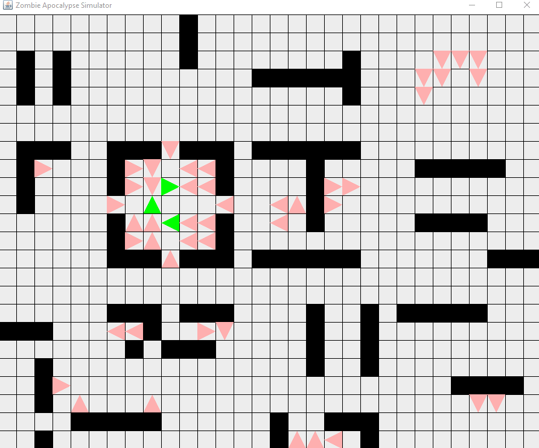

# Zombie-Simulator
An old 2D project from an undergraduate CS course

## Tokens:

### Green: Zombies
25% chance of changing direction and moves one space per step. Attempts to kill humans on its spot or directly in front of it.

### Pink: Humans
Takes two steps for each single zombie step. 20% chance of changing direction by default. Also have specials:

Human’s Fighting and Running - If they see a zombie in front of them more than 1 square away, they turn and run. If they see a zombie directly in front of them, they make a "fight or flight" decision. The fight or flight odds are 25% to fight. If they fight, there's a 50/50 shot of them killing the zombie, otherwise they do not harm the zombie (and the zombie will most likely infect them next turn). Dead zombies are shown as Black.

Human Counter-Attacks - Zombie will normally kill human directly in front of them or occupying the same grid, unless the human population is low. In that case, there is a chance the human will expect the zombie, and have a chance to attack first! a. As long as there are more humans than zombies then there is a 100% chance of the zombie killing the human. b. If zombies outnumber the living humans, then there 20% chance the human will turn and try and kill them. c. It goes up to 40% when the zombie population is twice as big as the living human population. d. It goes up to 80% when the zombie population is 5 times as big as the living human population. e. Humans can turn and kill a zombie only once a turn.

### Red: Dead Humans
After two steps, they become zombies. 

### Black: Dead Zombies
Dead zombies stay in place and do nothing.

### Black Square: Building
Takes entire space and nothing can go through it.

